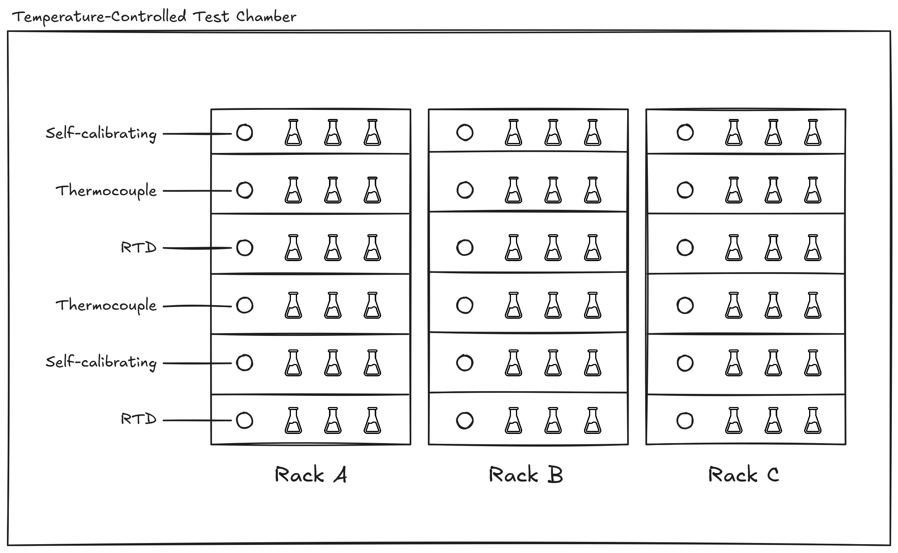

You are a research engineer working in a lab that's performing temperature-sensitive experiments in a temperature-controlled environment. The environment is supposed to keep the temperature constant, but there will still be slight variations in temperature distributed across the room that need to be accounted for in the experimental analysis, hence the need for sensors on each shelf of each rack.

You have a data pipeline that collects readings from the temperature sensors, performs some calibration and adjustment steps depending on the type of sensor, and performs an automated check to confirm that their readings are consistent. Every morning, you take a reading from each sensor in the lab to monitor that they're still working as expected.

Today, your sensor quality check test is failing: the batch standard deviation is nearly 12° when it should be under 2° in a chamber this stable. Nothing obvious has changed in the physical setup, and a quick visual scan of the raw readings in `sensor_readings.py` looks reasonable — all the sensors are reporting values somewhere in the 20s.

The processing code in `sensor_pipeline.py` is where the sensor calibration and quality post-processing logic lives.

You can assume that the raw sensor readings are correct, and that the quality check in `test_sensor_pipeline.py` is correct that the standard deviation of the sensors should be less than 2°.  Do not look at the git history.

You can run the failing test using `./run.sh`. **Your goal is to make the quality check test pass, so you will need to fix the bug in the processing pipeline.** If you're uncertain about whether a certain change is allowed, ask the study facilitator. Feel free to debug and make the change in whatever way feels natural, but you should not use an AI assistant. Please think aloud as you work.