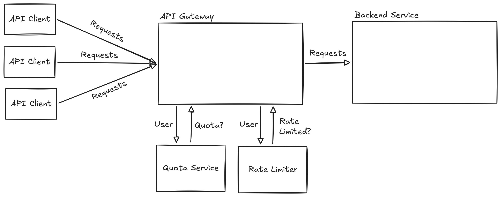

You’re a developer working on your company’s API Gateway, which manages how many requests users are allowed to send to your API service to prevent it from being overloaded by any one user. There are two types of limits: quotas (which are consumed for each request and are reset at the end of the week) and rate limits (which prevent you from making too many requests in a short period of time). You’ve gotten some bug reports from users that say they’re running out of quota faster than they expect to. You have a reproduction of the bug in `test_api_gateway.py`.

The API gateway code is in `api_gateway.py`. You can assume that code in `external_services.py` and `test_api_gateway.py` is correct. Do not look at the git history.

You can run the failing test using `./run.sh`. **Your goal is to make the quality check test pass, so you will need to fix the bug in the processing pipeline.** If you're uncertain about whether a certain change is allowed, ask the study facilitator. Feel free to debug and make the change in whatever way feels natural, but you should not use an AI assistant. Please think aloud as you work.